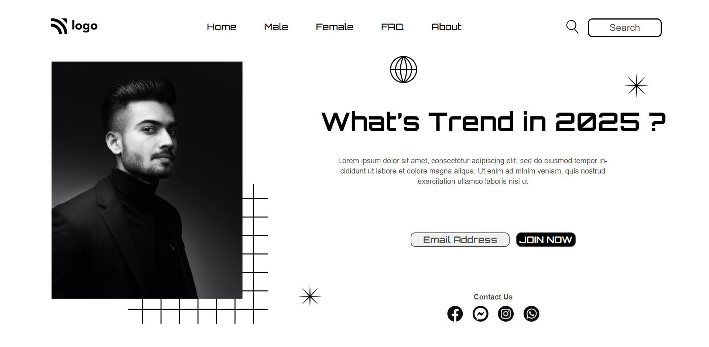

# Street Style Landing Page

## Project 01 🚀 Website's Live [Link](https://trends-in-2025.netlify.app/)🔗

>by Arpit Pathak

Screenshot

## What I learned from this Project? 

- Learned to use CSS position (Absolute & Relative) property.
- Learned to create underline on navbar link using ::after pseudo element.
- Learned about the z-index property to specifies the stack order of an element.
- Learned to ADD img elements (extra star) without touching html, I have used only css for that.

## Time taken to finish this project ⏳
- 4.30 hours
---